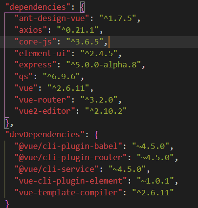
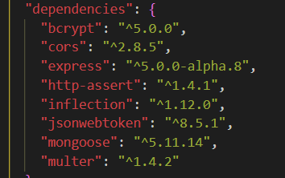

### 本地环境搭建

### 一、前端

#### 1、安装node

#### 2、全局安装vue脚手架

```
npm i @vue/cli -g
```

#### 3、安装webpack

```
npm i webpack -g
npm i webpack-cli -g
```

#### 4、用vue脚手架创建项目

```
vue create web
```

#### 5、安装项目依赖

```
若项目中有 package.json 文件
用 npm install 下载该项目所有依赖
```

#### 6、启动项目

```
npm run serve
```

#### 7、具体依赖截图



### 二、后端

#### 1、创建一个文件夹

#### 2、快速搭建node开发环境

```
npm init -y
```

#### 3、安装项目依赖

```
若项目有 package.json 文件
用 npm install 下载该项目所有依赖
```

#### 4、启动服务

```
node app
```

#### 5、具体依赖截图

